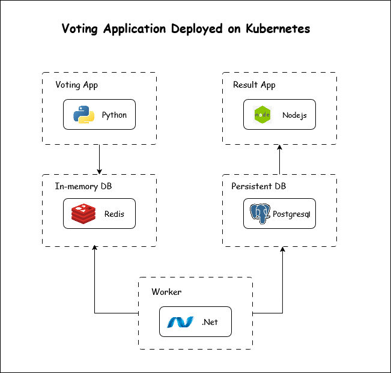

# Example Voting App

A simple distributed application running across multiple Docker containers.

## Getting started

## Run the app in Kubernetes

I am using docker desktop kubernetes which is single node kubernetes cluster and is great for learning.

The folder k8s-specifications contains the YAML specifications of the Voting App's services.

Run the following command to create the deployments and services. Note it will create these resources in your current namespace (`default` if you haven't changed it.)

```shell
kubectl create -f k8s-specifications/
```

The `vote` web app is then available on port 31000 on each host of the cluster, the `result` web app is available on port 31001.

To remove them, run:

```shell
kubectl delete -f k8s-specifications/
```

The `vote` app will be running at [http://localhost:31000](http://localhost:31000), and the `results` will be at [http://localhost:31001](http://localhost:31001).

## Architecture



- A front-end web app in [Python](/vote) which lets you vote between two options
- A [Redis](https://hub.docker.com/_/redis/) which collects new votes
- A [.NET](/worker/) worker which consumes votes and stores them in…
- A [Postgres](https://hub.docker.com/_/postgres/) database backed by a Docker volume
- A [Node.js](/result) web app which shows the results of the voting in real time

## Enhancements (Kubernetes Features I Added)

- Node Affinity → Ensures specific pods are scheduled only on designated nodes for better control and reliability.
- Secrets → Kubernetes Secret manifests are used to securely store sensitive data such as Postgres username and password, instead of hardcoding them in configs.
- Persistent Volumes → Postgres database uses a mounted volume to persist data even if the pod restarts.

## Notes

The voting application only accepts one vote per client browser. It does not register additional votes if a vote has already been submitted from a client.
